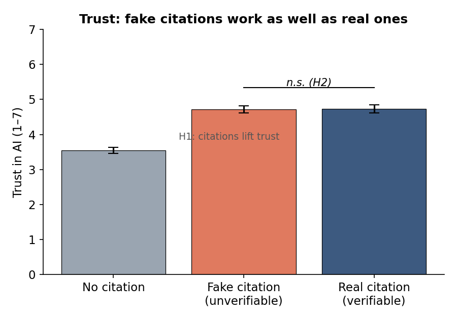
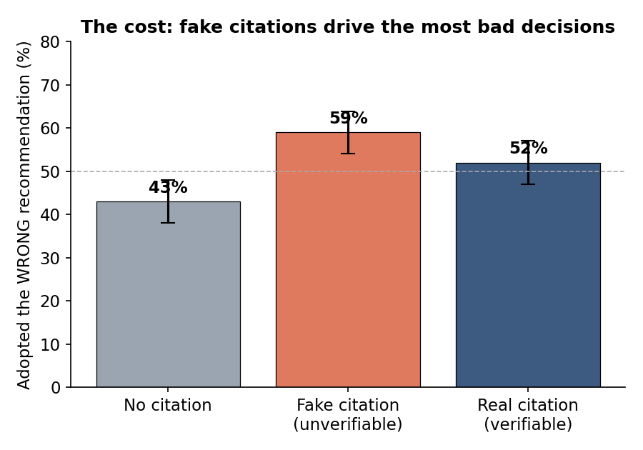
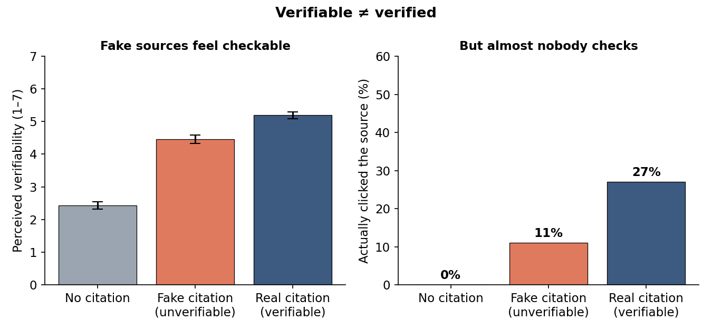

# Verification Theater

**Do unverifiable citations make AI recommendations more persuasive — without making decisions better?**

A three-condition behavioral experiment on how the *verifiability* of an AI's
source citations shapes consumer trust and decision quality. Complete
experimental design plus a full analysis pipeline, demonstrated end-to-end on
simulated data.


---

## Motivation

AI assistants increasingly justify their recommendations by citing sources. But
a citation can *look* authoritative while being impossible to actually verify —
a fabricated report title, a dead link, a real page that doesn't say what the AI
claims. This project asks whether the mere **appearance** of sourcing is enough
to earn trust, even when nothing behind it can be checked.

> **Verification theater** — the central idea: unverifiable citations may lift
> trust just as much as genuine ones, while doing nothing to improve (and
> possibly harming) the quality of the resulting decision. The *performance* of
> being sourced substitutes for the substance of it.

---

## Design

A three-group between-subjects experiment. Participants choose the "better
value" between two laptops. **Laptop A is objectively superior on every spec**
(cheaper, faster CPU, more memory, longer battery, longer warranty). An AI
assistant **recommends the worse option (Laptop B)** to everyone. The only thing
that varies across groups is the *citation format* attached to that identical,
wrong recommendation:

| Condition | Citation attached to the (wrong) recommendation |
|-----------|--------------------------------------------------|
| **C1 — None** | Reasoning only, no sources |
| **C2 — Fake** | Professional-looking sources that cannot be verified (fabricated report titles, dead links) |
| **C3 — Real** | Genuine, clickable, verifiable sources — whose interpretation is nonetheless misleading |

Holding the recommendation and its wording constant isolates the causal effect
of *verifiability* alone. The symmetric design (all conditions recommend the
wrong option) trades some realism for clean causal inference.

---

## Hypotheses & findings (on simulated data)

| # | Hypothesis | Result |
|---|-----------|--------|
| **H1** | Citations (C2, C3) raise trust vs no citation (C1) | Supported — large effect (d ≈ 1.2) |
| **H2** | Fake ≈ Real on trust (appearance is enough) | Supported — no significant difference (p ≈ .91) |
| **H3** | Fake citations drive the most adoption of the *wrong* recommendation | Directionally supported — C2 highest (≈59% vs ≈43%) |
| **Mechanism** | Fake sources raise *perceived verifiability* | Supported — C2 ≫ C1 (d ≈ 1.7) |
| **Behavior** | "Verifiable ≠ verified": few check even real sources | Only ≈27% clicked the genuine, clickable source |

> These results come from **simulated** data generated under the hypothesized
> effect sizes; they demonstrate that the analysis pipeline correctly recovers
> the predicted pattern, not empirical findings from human participants. The
> omnibus test for H3 is borderline under the fixed random seed (a reminder that
> adequate sample size matters); the key pairwise contrast (fake vs none) is
> significant.

---

## Figures

**Fake citations lift trust as much as real ones (H1 + H2):**



**The cost — fake citations drive the most bad decisions (H3):**



**Verifiable ≠ verified — fake sources *feel* checkable, yet almost nobody checks:**



---

## Measures

Trust is adapted from McKnight, Choudhury & Kacmar (2002), *Information Systems
Research* (competence / benevolence / integrity). The study also measures
perceived verifiability (a candidate mediator), decision confidence, actual
source-click behavior, plus manipulation and attention checks. Full instruments
in [`materials/03_measures.md`](materials/03_measures.md).

---

## Method notes

- **Power analysis** ([`analysis/power_analysis.py`](analysis/power_analysis.py)):
  target n ≈ 100/cell for 80% power; recruit 120/cell to absorb MTurk exclusions.
- **Data quality:** attention checks, manipulation checks, ≥95% approval and
  ≥500 completed HITs as qualifications, completion-code verification.
- **Ethics:** informed consent + full debrief (the design uses benign
  deception). This is an individual design/learning project — **not
  IRB-approved**; real data collection would require institutional IRB review.

---

## Repository structure

```
verification_theater/
├── README.md
├── materials/
│   ├── 01_product_specs.md      decision task & laptop specs
│   ├── 02_stimuli.md            the three-condition recommendation stimuli
│   ├── 03_measures.md           trust scale, verifiability, checks, demographics
│   ├── 04_consent_debrief.md    informed consent + debrief
│   └── 05_mturk_setup.md        sampling, payment, qualifications, platform
├── analysis/
│   ├── power_analysis.py        sample-size justification
│   ├── simulate_and_analyze.py  simulate data + H1/H2/H3 + mechanism
│   ├── make_figures.py          generate the three figures
│   └── fig1–3_*.png             output figures
├── data/
│   └── simulated_data.csv       simulated dataset
└── docs/
    └── design.md                design rationale
```

---

## How to run

```bash
python3 analysis/power_analysis.py        # sample-size justification
python3 analysis/simulate_and_analyze.py  # simulate data + H1/H2/H3 + mechanism
python3 analysis/make_figures.py          # regenerate the three figures
```

Requires Python 3 with `numpy`, `scipy`, and `matplotlib`.

---

*Independent research design by Quanjun (Leah) Li.*
